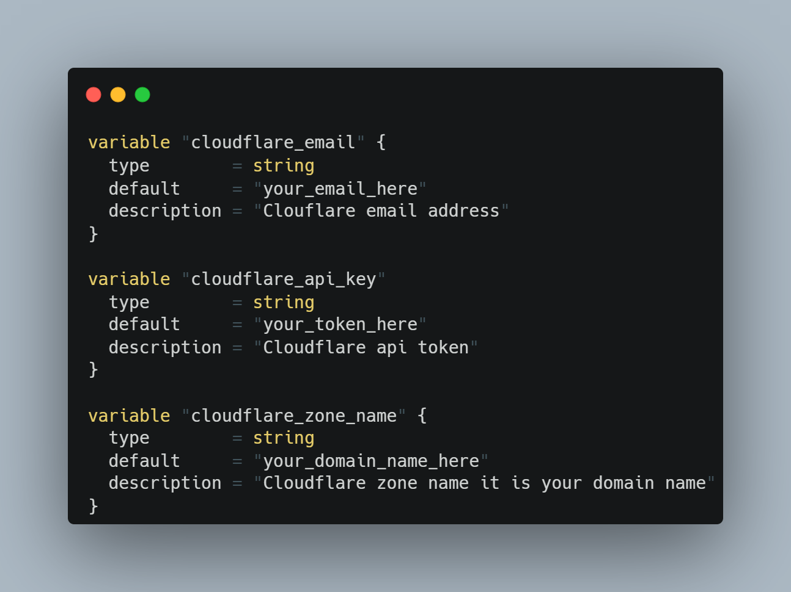
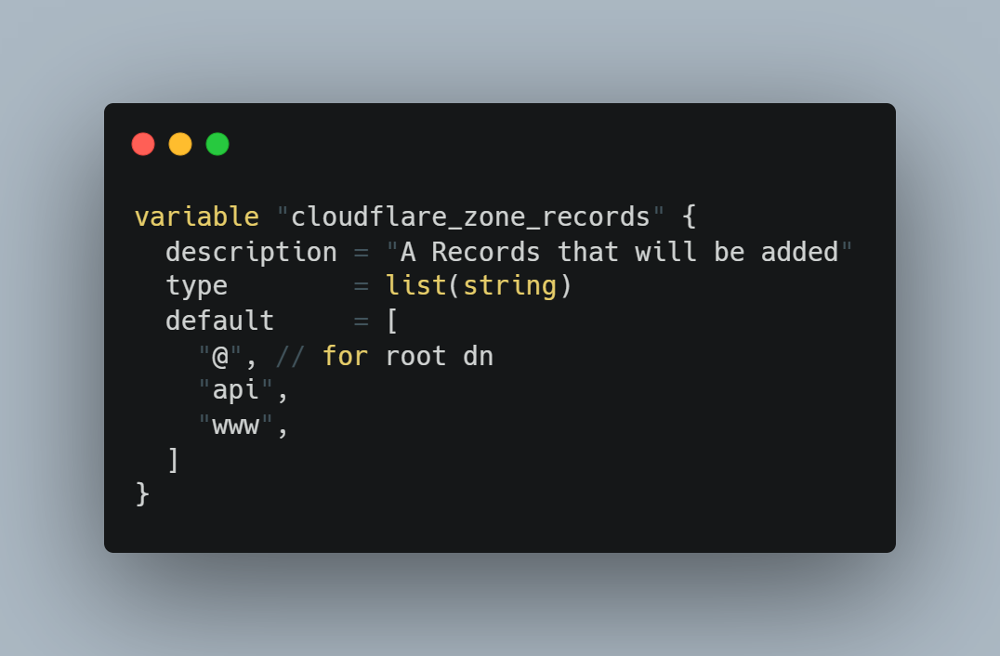
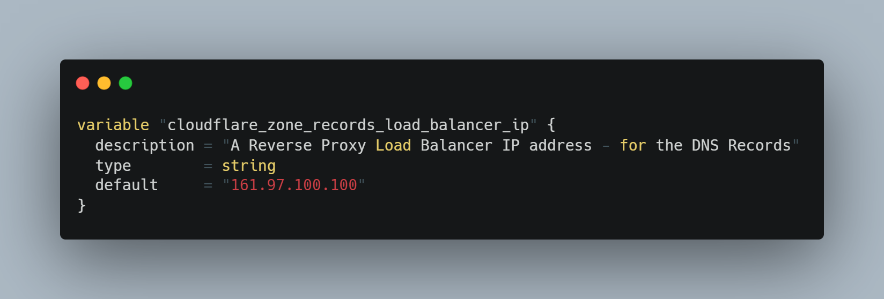
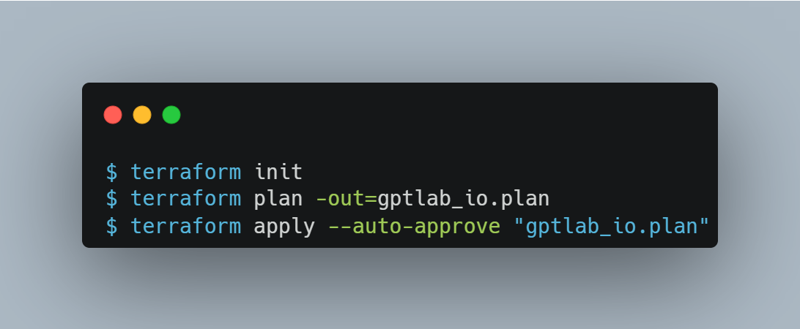

# Terraform | Cloudflare Provider

This Cloudflare provider is used to interact with resources supported by Cloudflare. 
The provider needs to be configured with the proper credentials(tokens) before it can be used.

This is simple example code of how to use the add your DNS records for your zone and change some zone setting, in our case change SSL mode to "flexible" in order to encrypts traffic between the browser and Cloudflare.
Keep in mind that - Terraform will check the status of the zone. It must be active, otherwise it won't start.Second thing is - if your record is `www` - it won't proceed as a `A` record - it will use `CNAME` because of the best practise - and redirect it to the your zone name.

## Cloudflare Token
In order to use the provider you need to [obtain](https://developers.cloudflare.com/api/tokens/create/) the necessary token. It seems that Cloudflare provide API Tokens which are in beta as of writing, they dont seem to be supportedm so ensure you use your Global API Key.

## Set Variables

### Add Global Variables
You can either edit the default variables from the `variables.tf` file, or send them via command line while executing the terraform (plan|apply)

### Add DNS Records

In our case it is simple.
- `@` - for root domain name
- `api` - for our backend service
- `www` - it will be `CNAME` for root dn

### Add Load Balancer IP address

In our case - it is one Application Load Balancer

## Terraform Backend
This example uses local backend(./states directory) in order to store states, you can easily whatever you want

## Usage

## Useful documentation
https://github.com/cloudflare/terraform-provider-cloudflare
https://registry.terraform.io/providers/cloudflare/cloudflare/latest/docs/resources/zone
https://registry.terraform.io/providers/cloudflare/cloudflare/latest/docs/resources/zone_settings_override

&copy; Habib Guliyev | graypit@gmail.com | https://gptlab.io
